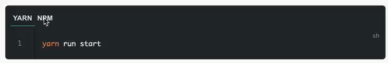

# vuepress-plugin-npm2yarn

translate npm(yarn) bash to yarn(npm) bash

## How to use

```js
// ```bash npm2yarn
// yarn run start
// ```
```


## Install

```bash
npm install vuepress-plugin-npm2yarn
```

